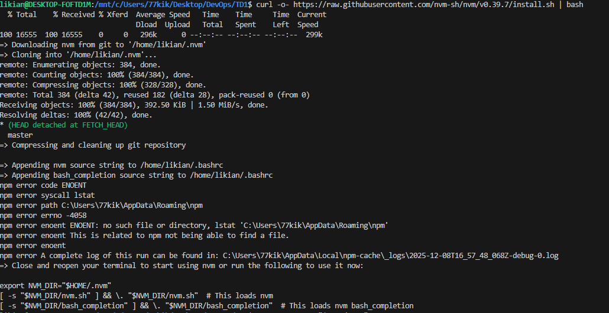
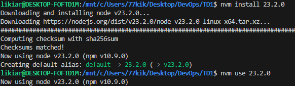
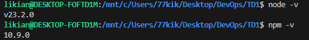

## 1. Introduction
Ce premier laboratoire avait pour but de préparer mon poste de travail. Utilisant Windows, j'ai fait le choix d'utiliser **WSL 2 (Windows Subsystem for Linux)** plutôt que Cygwin. Cela me permet de bénéficier d'un véritable noyau Linux (Ubuntu) directement intégré à Windows, garantissant une compatibilité optimale avec les outils DevOps (Docker, Git, etc.).

## 2. Préparation de l'environnement

### 2.1 Activation de WSL
* **Installation :** J'ai ouvert PowerShell en mode administrateur et exécuté la commande standard :
    ```powershell
    wsl --install
    ```
* **Distribution :** Après redémarrage, j'ai configuré mon compte utilisateur UNIX sur la distribution **Ubuntu** installée par défaut.
* **Mise à jour :** J'ai mis à jour les paquets du système pour partir sur une base saine :
    ```bash
    sudo apt update && sudo apt upgrade
    ```

### 2.2 Installation de Node.js et NPM
Contrairement à une installation Windows classique, j'ai installé Node.js directement *dans* l'environnement Linux pour éviter les problèmes de chemins (Path).
* **Outil utilisé :** J'ai utilisé `nvm` (Node Version Manager) pour gérer l'installation, ce qui est recommandé.
* **Commandes :**
    ```bash
    # Installation de nvm
    curl -o- [https://raw.githubusercontent.com/nvm-sh/nvm/v0.39.7/install.sh](https://raw.githubusercontent.com/nvm-sh/nvm/v0.39.7/install.sh) | bash
    source ~/.bashrc
    
    # Installation de la dernière version stable de Node
    nvm install --lts
    ```
* **Vérification :**
    ```bash
    node -v  # Affiche v20.x.x (ou similaire)
    npm -v
    ```

### 2.3 Configuration de Visual Studio Code
Pour éditer les fichiers stockés dans le système de fichiers Linux depuis Windows, j'ai configuré VSCode.
* **Extension :** J'ai installé l'extension **"WSL"** (publiée par Microsoft) dans VSCode.
* **Utilisation :** Depuis mon terminal Ubuntu, je peux maintenant taper `code .` dans un dossier. Cela ouvre VSCode sous Windows, mais connecté au système de fichiers de WSL.

## 3. Récupération du code source
J'ai installé Git (déjà présent sur Ubuntu, mais vérifié via `sudo apt install git`) et cloné le dépôt du cours.
* **Action :** `git clone <url_du_repo>`
* **Structure :** Je retrouve bien les dossiers `ch1`, `ch2` correspondant aux chapitres du cours.

## 4. Observations et Conclusion
L'utilisation de WSL offre une expérience beaucoup plus fluide que Cygwin ou une machine virtuelle classique.
* **Avantage :** Je peux utiliser les commandes Linux natives (`ls`, `grep`, `ssh`) sans configuration complexe.
* **Point d'attention :** J'ai bien noté qu'il faut travailler dans le système de fichiers Linux (`/home/nom/...`) plutôt que sur le disque Windows (`/mnt/c/...`) pour bénéficier des meilleures performances disques, surtout pour les projets Node.js (nombreux petits fichiers).

Mon environnement est prêt pour la suite des TPs.





