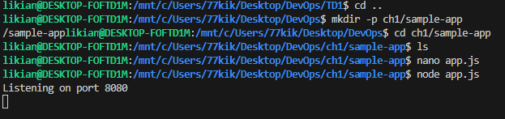
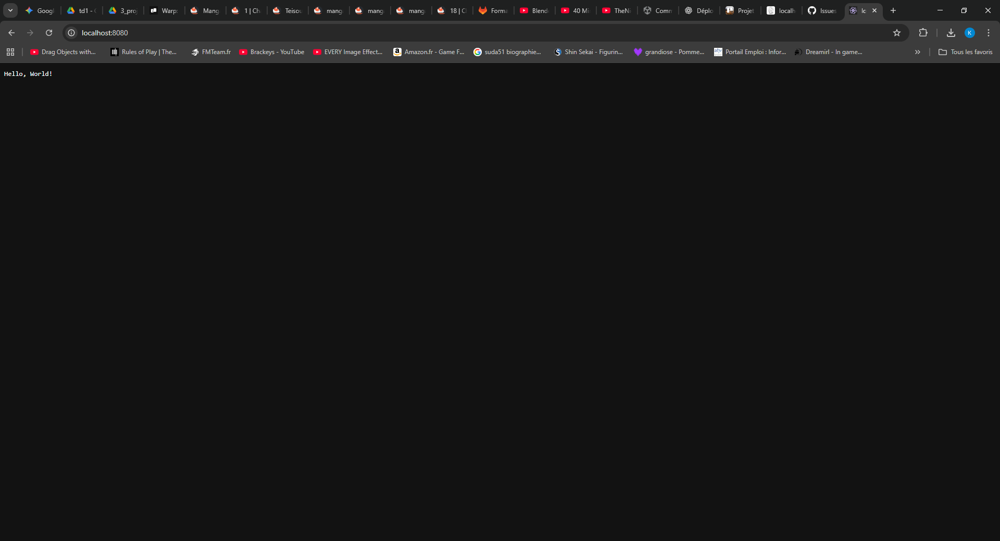
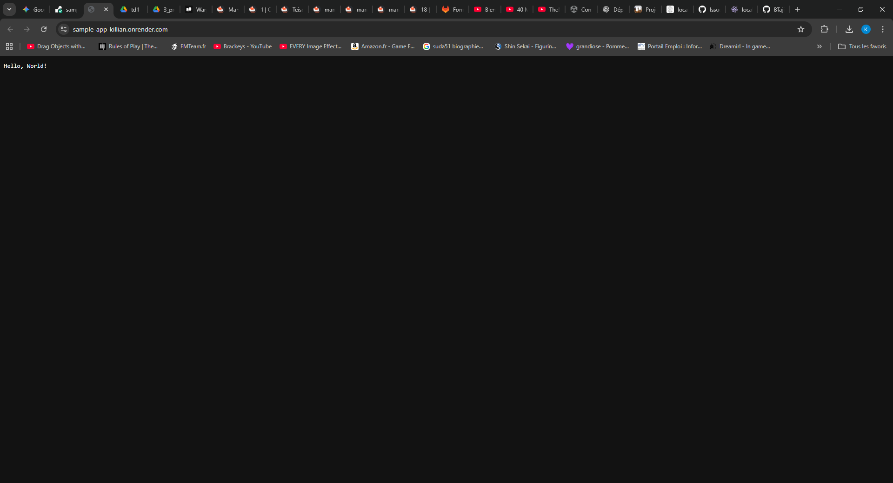
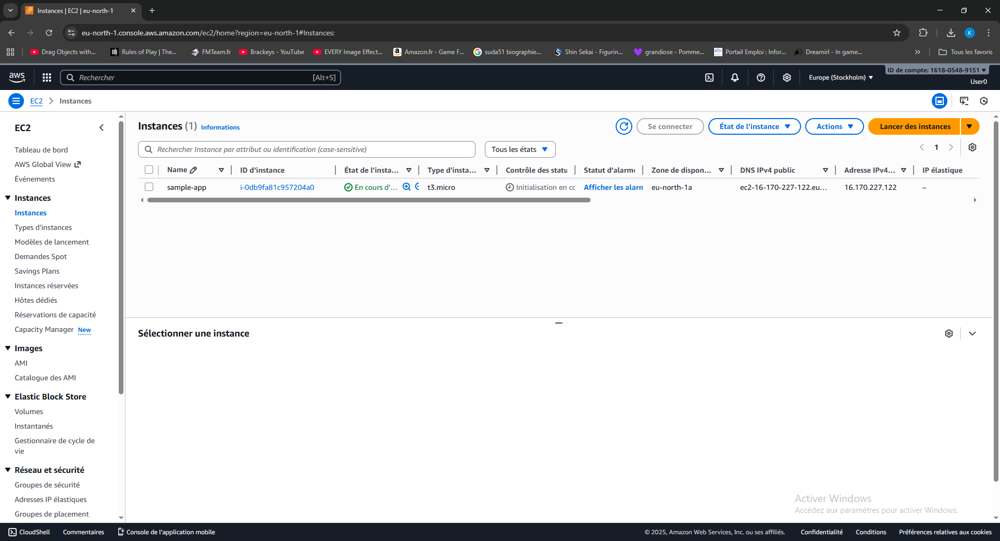
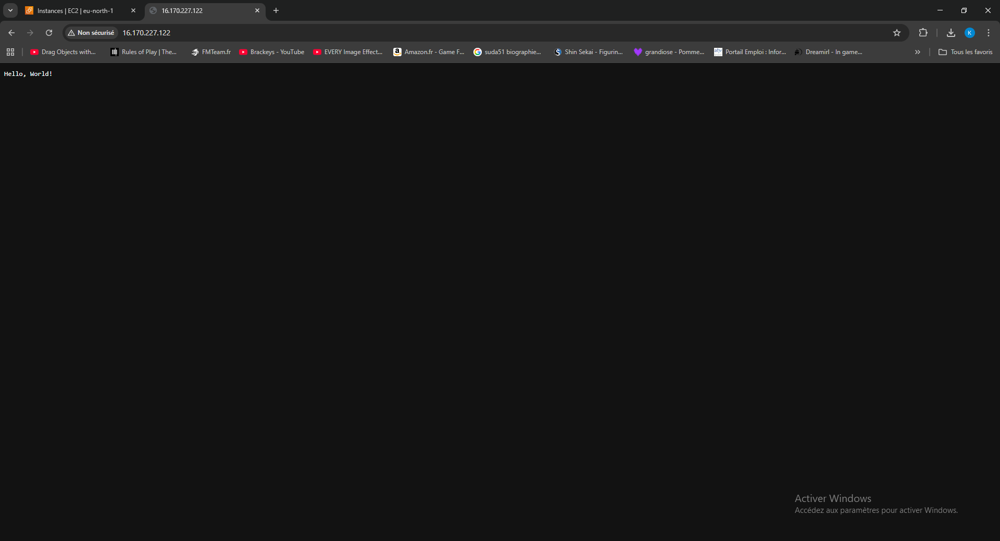

## 1. Objectifs
L'objectif de ce TP était de comprendre l'évolution du déploiement : de l'exécution locale sur ma machine, vers une plateforme gérée (PaaS), et enfin vers une infrastructure gérée manuellement (IaaS) sur AWS.

## 2. Partie 1 : Exécution Locale
J'ai commencé par créer une application "Hello World" minimaliste.
* **Code (`app.js`) :** Création d'un serveur HTTP simple écoutant sur le port 8080.
* **Test :**
    ```bash
    node app.js
    ```
* **Observation :** En allant sur `localhost:8080` dans mon navigateur, le message s'affiche. C'est rapide pour le développement, mais inefficace pour la production (dépend de ma machine allumée).

## 3. Partie 2 : Déploiement sur PaaS (Render)
J'ai utilisé Render pour héberger l'application.
* **Manipulation :** J'ai connecté mon compte GitHub à Render et sélectionné le dépôt contenant mon application.
* **Avantages constatés :**
    * Je n'ai pas eu à configurer de serveur.
    * Le HTTPS est géré automatiquement.
    * Le déploiement se fait à chaque `git push`.
* **Inconvénients :** J'ai peu de contrôle sur la machine sous-jacente (OS, réseau précis).

## 4. Partie 3 : Déploiement sur IaaS (AWS EC2)
C'était la partie la plus technique. J'ai dû gérer un serveur virtuel de A à Z.

### 4.1 Lancement de l'instance
* Via la console AWS, j'ai lancé une instance **EC2 t2.micro** (Amazon Linux 2).
* **Sécurité :** J'ai créé un Security Group autorisant :
    * Port 22 (SSH) : Pour que je puisse me connecter.
    * Port 8080 (HTTP) : Pour accéder à l'app.

### 4.2 Installation manuelle
Je me suis connecté en SSH à l'instance :
```bash
ssh -i ma-cle.pem ec2-user@<IP_PUBLIQUE>
```
Une fois connecté, j'ai dû installer les dépendances manuellement :

```bash
curl -o- [https://raw.githubusercontent.com/nvm-sh/nvm/v0.34.0/install.sh](https://raw.githubusercontent.com/nvm-sh/nvm/v0.34.0/install.sh) | bash
. ~/.nvm/nvm.sh
nvm install node
```

J'ai ensuite créé le fichier app.js sur le serveur (via nano) et lancé l'application.

## 5. Difficultés et Conclusion
Difficulté : Au début, l'application n'était pas accessible car j'avais oublié d'ouvrir le port 8080 dans le Security Group AWS (Pare-feu).

Conclusion : Le IaaS offre un contrôle total mais demande beaucoup de travail manuel (connexion, installation, mises à jour). Le PaaS est bien plus simple mais plus "boîte noire".






