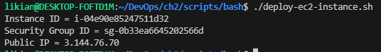
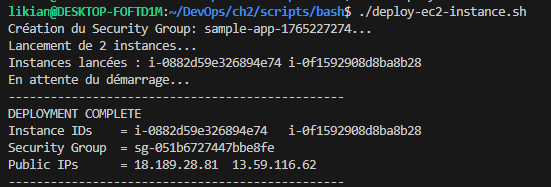
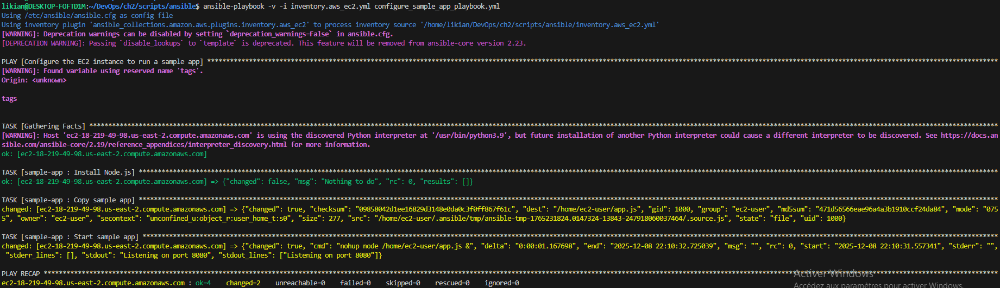
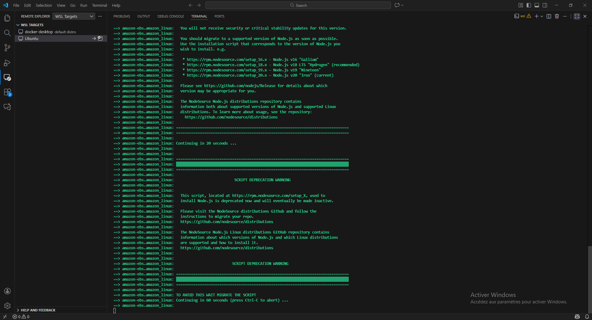
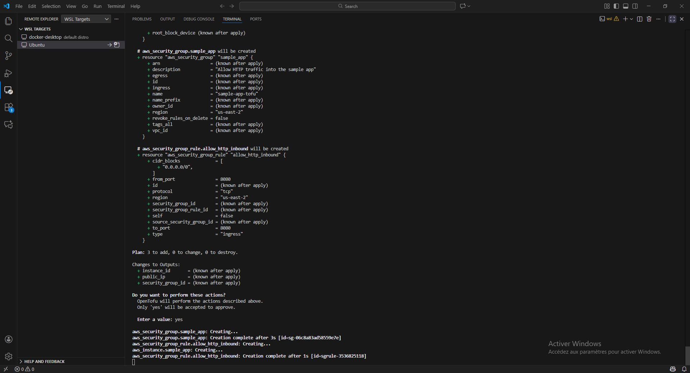
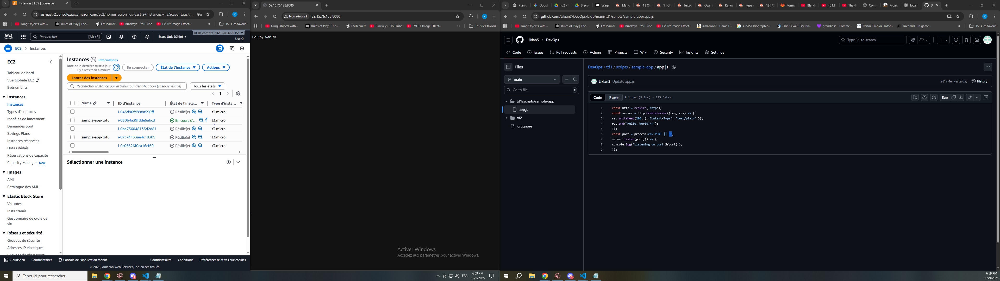
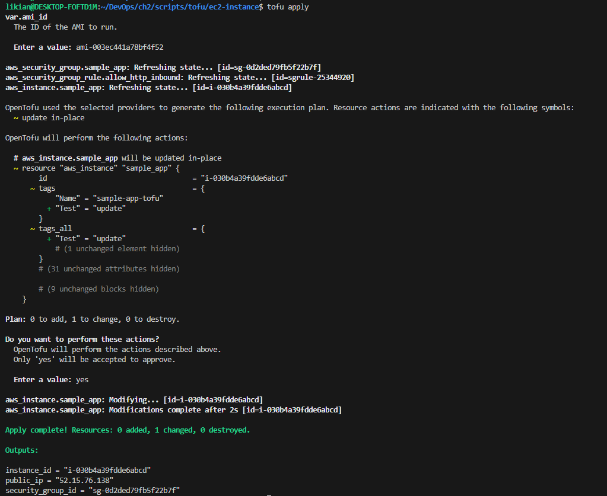
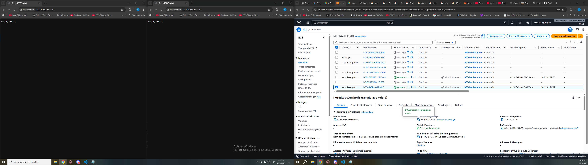
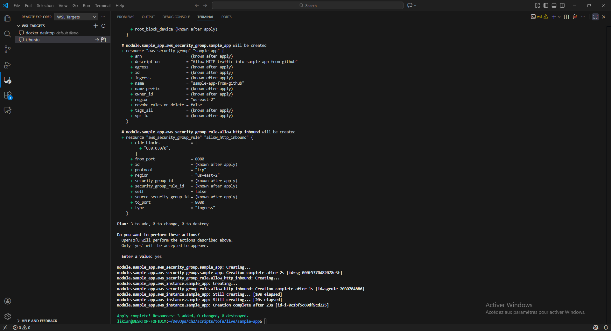

## 1. Introduction
Après avoir souffert de la configuration manuelle au Lab 1, ce TP m'a permis de découvrir comment automatiser la création et la configuration des serveurs via du code. Nous avons exploré quatre catégories d'outils.

## 2. Les approches testées

### 2.1 Scripts Ad-hoc (Bash)
J'ai écrit un script Bash utilisant `aws cli` pour lancer une instance.
* **Commande :** `aws ec2 run-instances --image-id ...`
* **Critique :** C'est impératif. Si je lance le script deux fois, je crée deux serveurs et je paye le double. Ce n'est pas idempotent.

### 2.2 Gestion de Configuration (Ansible)
J'ai utilisé Ansible pour configurer l'intérieur du serveur une fois celui-ci allumé.
* **Fichier :** `playbook.yml`
* **Action :** Le playbook installe Node.js, copie le code de l'application et démarre le service.
* **Avantage :** Syntaxe YAML lisible. Idempotent (si Node est déjà là, il ne le réinstalle pas).

### 2.3 Templating de Serveur (Packer)
Au lieu de configurer le serveur au démarrage, j'ai "cuit" (baked) l'application directement dans l'image disque (AMI).
* **Outil :** HashiCorp Packer.
* **Fichier :** `sample-app.pkr.hcl`.
* **Processus :** Packer lance une instance temporaire, exécute les scripts d'installation, crée une AMI, et détruit l'instance temporaire.
* **Résultat :** J'ai obtenu une AMI ID personnalisée prête à l'emploi.

### 2.4 Provisioning (OpenTofu)
C'est l'outil principal pour gérer le cycle de vie de l'infra (similaire à Terraform).
* **Fichiers :** `main.tf` (définition de l'instance, du SG), `variables.tf`.
* **Workflow :**
    1.  `tofu init` : Initialisation des plugins AWS.
    2.  `tofu plan` : Prévisualisation des actions (ex: "+ create 1 instance").
    3.  `tofu apply` : Application réelle sur AWS.
* **Expérience :** J'ai utilisé l'AMI créée par Packer dans mon code OpenTofu. J'ai ensuite modifié un tag dans le code et réappliqué : OpenTofu a détecté le changement et mis à jour la ressource sans tout détruire.

## 3. Conclusion
L'association **Packer + OpenTofu** semble être la plus robuste : Packer crée des images immuables (fiables) et OpenTofu déploie l'infrastructure qui utilise ces images. J'ai bien compris l'importance de l'idempotence pour éviter les erreurs humaines.

