## 1. Objectifs
Gérer un seul serveur ne suffit pas. Ce TP visait à assurer la haute disponibilité et la mise à jour sans interruption (Zero Downtime) via trois paradigmes.

## 2. Orchestration de Machines Virtuelles (AWS ASG)
* **Architecture :** J'ai défini dans OpenTofu un **Auto Scaling Group (ASG)** couplé à un **Load Balancer (ALB)**.
* **Fonctionnement :** L'ASG s'assure qu'il y a toujours X instances qui tournent. Le Load Balancer répartit le trafic.
* **Mise à jour :** Pour mettre à jour l'app, j'ai changé l'AMI ID dans le code OpenTofu. L'ASG a effectué un "Rolling Update" (remplacement progressif des machines).
* **Observation :** C'est robuste mais lent (plusieurs minutes pour remplacer les VMs).

## 3. Orchestration de Conteneurs (Docker & Kubernetes)
* **Dockerisation :** J'ai créé un `Dockerfile`.
    ```dockerfile
    FROM node:alpine
    COPY . /app
    CMD ["node", "app.js"]
    ```
    J'ai buildé l'image et l'ai testée en local.
* **Kubernetes (K8s) :**
    * J'ai créé un cluster EKS sur AWS.
    * J'ai écrit des manifestes YAML : `Deployment` (pour gérer les répliques des pods) et `Service` (pour exposer l'app).
    * **Commande :** `kubectl apply -f deployment.yaml`.
* **Comparaison :** Les mises à jour sont beaucoup plus rapides qu'avec les VMs car les conteneurs démarrent en quelques secondes.

## 4. Orchestration Serverless (AWS Lambda)
* **Concept :** J'ai adapté mon code Node.js pour qu'il exporte une fonction `handler` au lieu de lancer un serveur express.
* **Déploiement :** J'ai utilisé OpenTofu (module `lambda`) pour zipper le code et le pousser sur AWS Lambda + API Gateway.
* **Test :** J'ai reçu une URL HTTPS fournie par AWS.
* **Observation :** C'est l'approche la plus simple d'un point de vue opérationnel. Pas de serveurs, pas d'OS, facturation à la milliseconde.

## 5. Conclusion
J'ai pu expérimenter les compromis :
* **VM :** Contrôle total, mais maintenance lourde et lenteur.
* **K8s :** Standard de l'industrie, très puissant pour les microservices, mais complexe à configurer.
* **Serverless :** Idéal pour l'événementiel et les économies, mais contraintes sur le code (stateless).


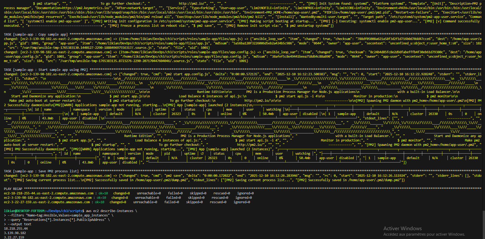
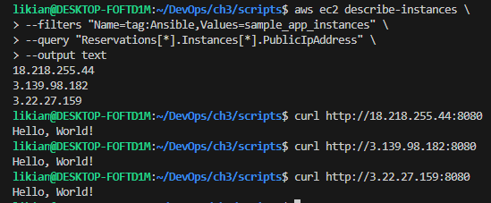
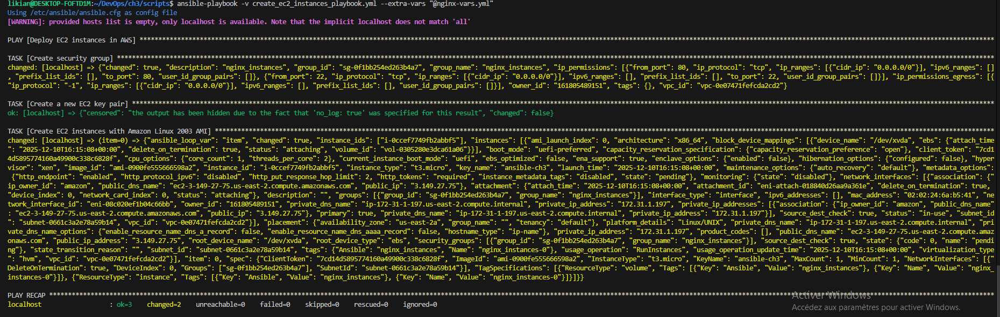
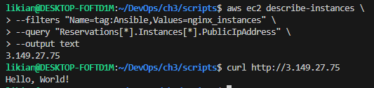
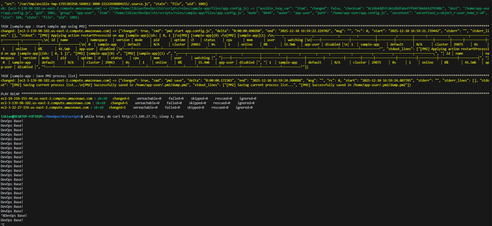
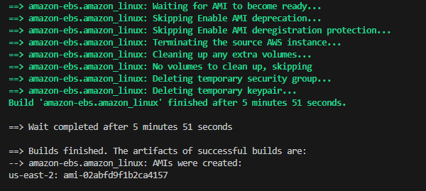
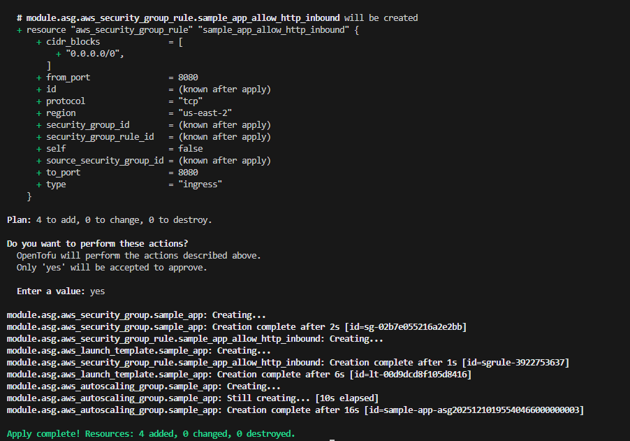
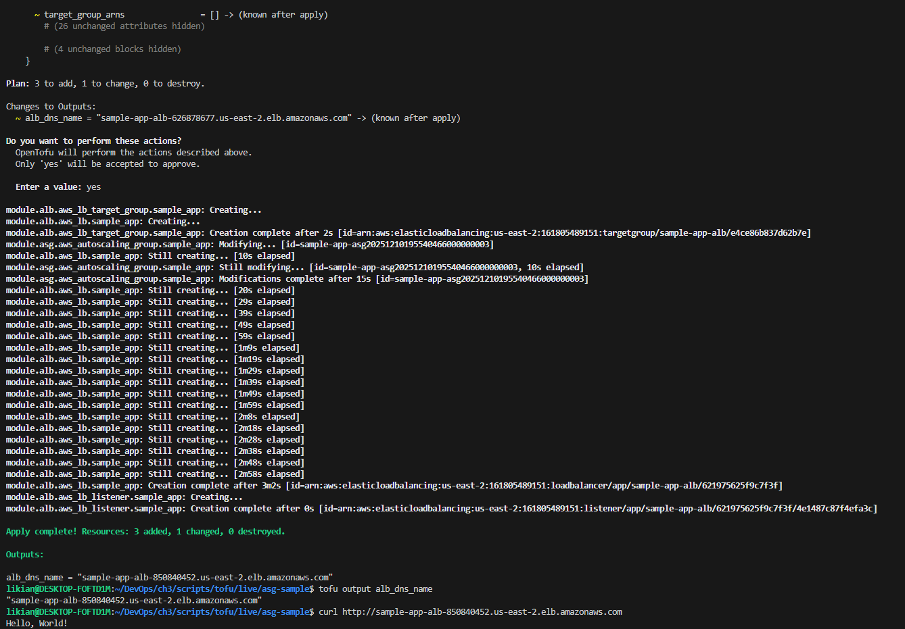
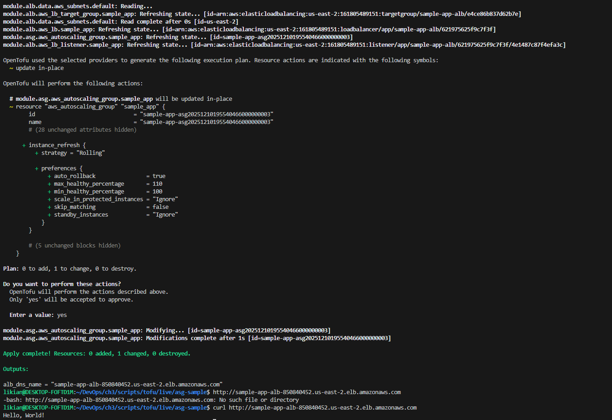
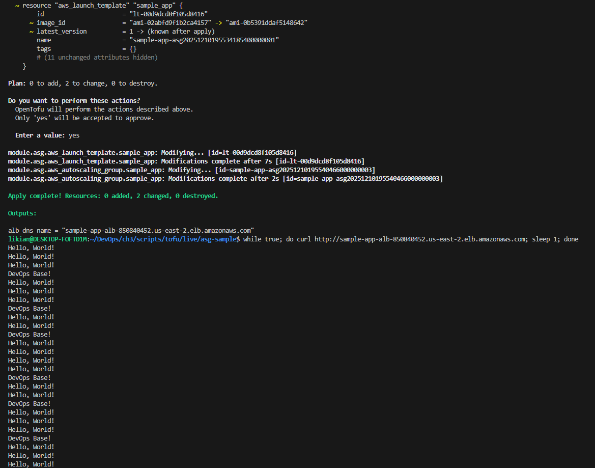
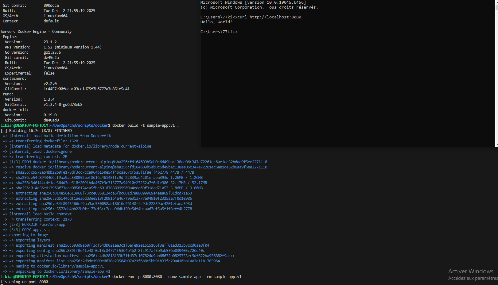
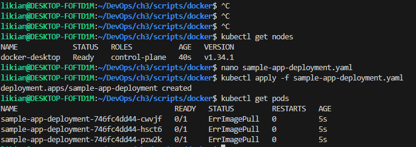
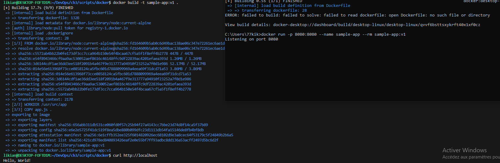
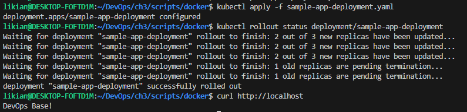
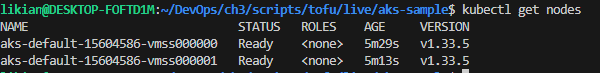
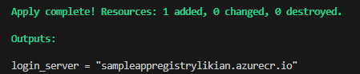
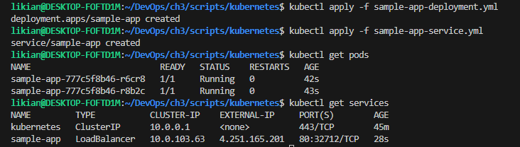
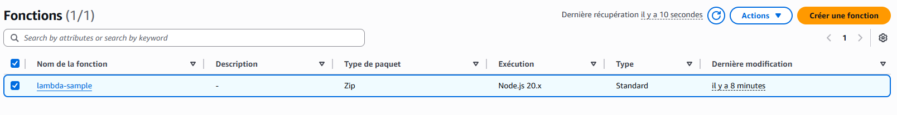
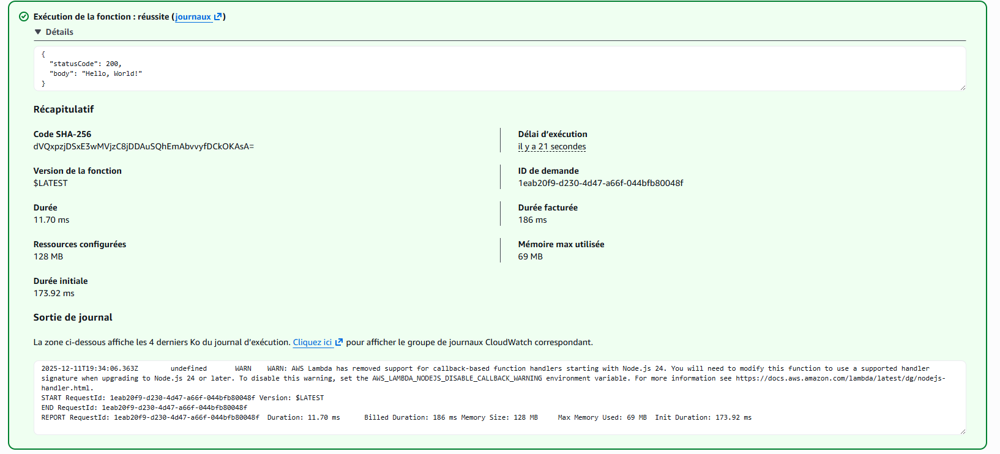
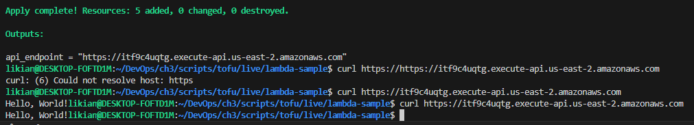
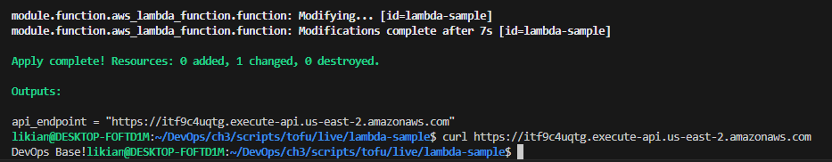
