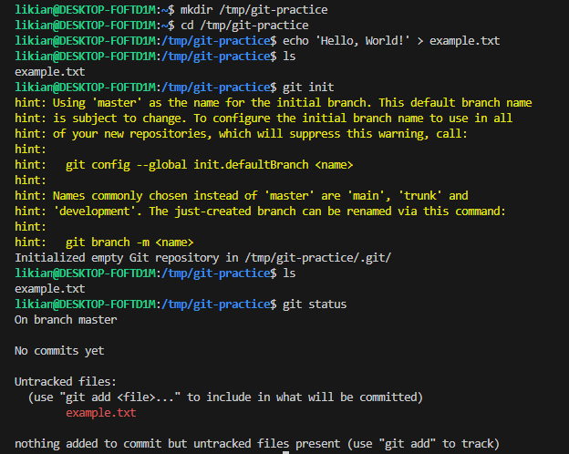
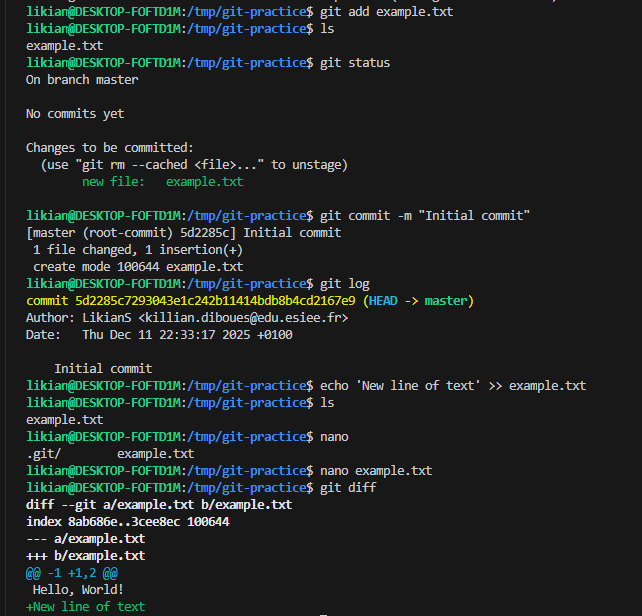
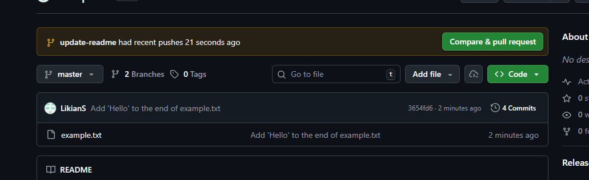
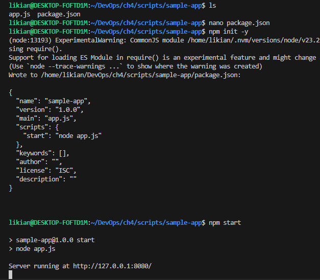
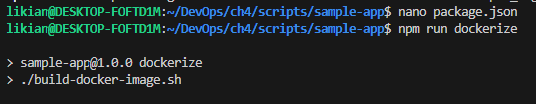
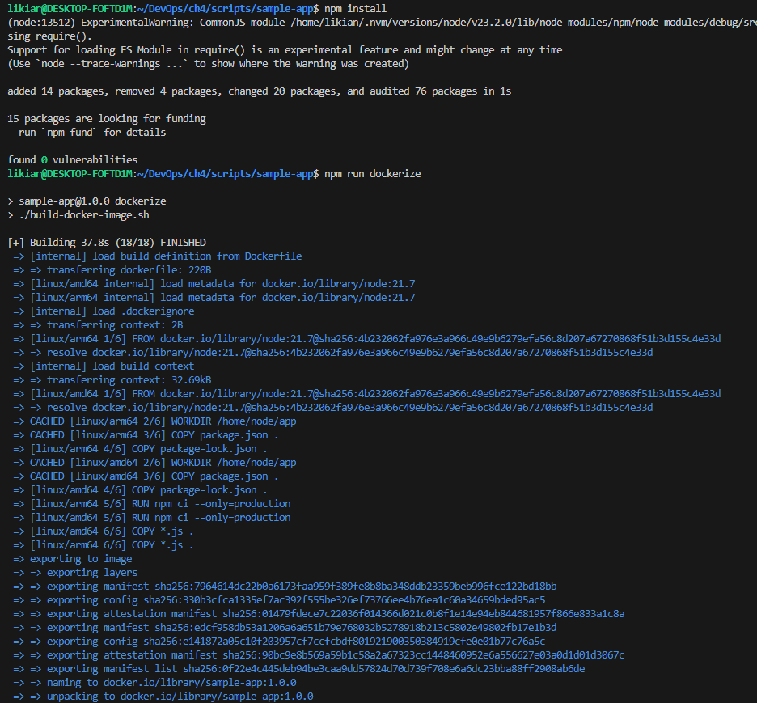
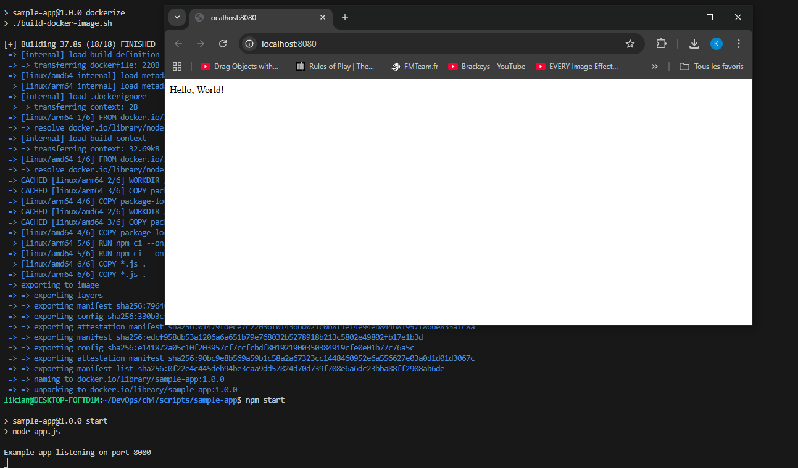
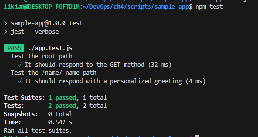
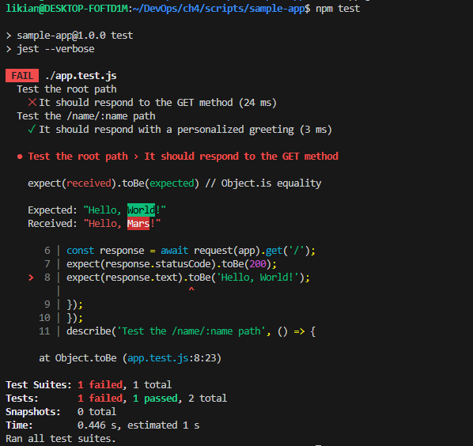

## 1. Introduction
Avant d'automatiser le déploiement (CI/CD), il faut s'assurer de la qualité du code. Ce TP s'est concentré sur les outils locaux pour garantir cette qualité.

## 2. Gestion de Version (Git)
J'ai simulé un workflow d'équipe standard.
* **Branching :** J'ai pris l'habitude de ne pas commiter sur `main`.
    `git checkout -b feature/nouvelle-route`
* **Pull Requests (PR) :** J'ai poussé ma branche sur GitHub et ouvert une PR. Cela permet la revue de code avant la fusion.
* **Conflits :** J'ai provoqué volontairement un conflit de fusion (deux modifications sur la même ligne) pour apprendre à le résoudre manuellement via VSCode.

## 3. Automatisation avec NPM
Pour éviter de taper des commandes longues, j'ai utilisé le `package.json`.
* J'ai défini des scripts :
    ```json
    "scripts": {
      "start": "node src/index.js",
      "test": "jest",
      "lint": "eslint src/"
    }
    ```
* Cela permet à tout nouveau développeur de lancer `npm install` puis `npm test` sans connaître les outils internes.

## 4. Tests Automatisés
C'était la partie centrale du TP.
* **Tests Unitaires (Jest) :** J'ai écrit des tests pour vérifier des fonctions isolées (ex: une fonction de calcul). J'ai utilisé `expect(value).toBe(...)`.
* **Tests d'Intégration (SuperTest) :** J'ai testé l'API HTTP réelle.
    ```javascript
    const request = require('supertest');
    // Teste si GET / renvoie 200 OK
    await request(app).get('/').expect(200);
    ```
* **TDD (Test Driven Development) :** J'ai réalisé l'exercice consistant à écrire le test *avant* la fonction. Le test échoue (Rouge), j'écris le code minimal, le test passe (Vert), je refactorise.

## 5. Conclusion
J'ai compris que les tests automatisés sont le filet de sécurité indispensable au DevOps. Sans tests fiables (`npm test` qui renvoie vert), on ne peut pas automatiser le déploiement sereinement.









