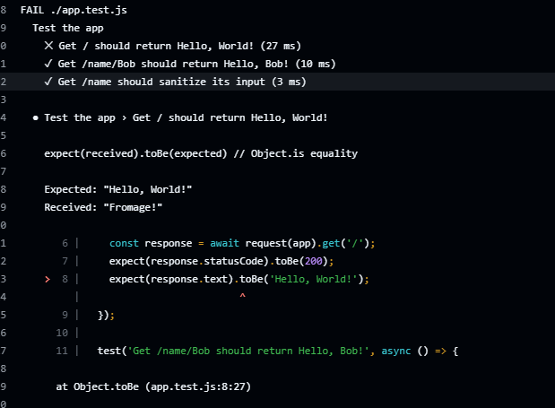
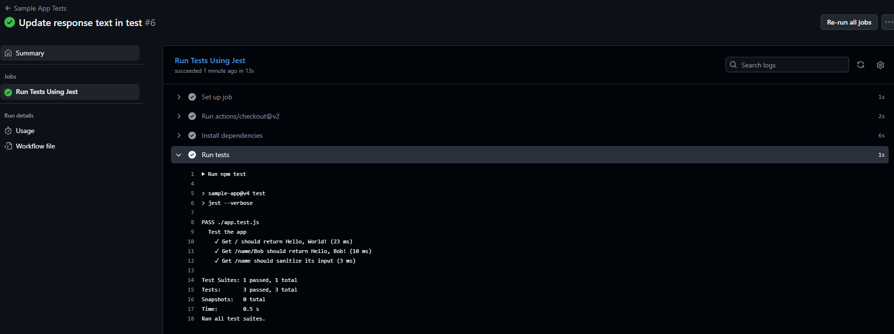
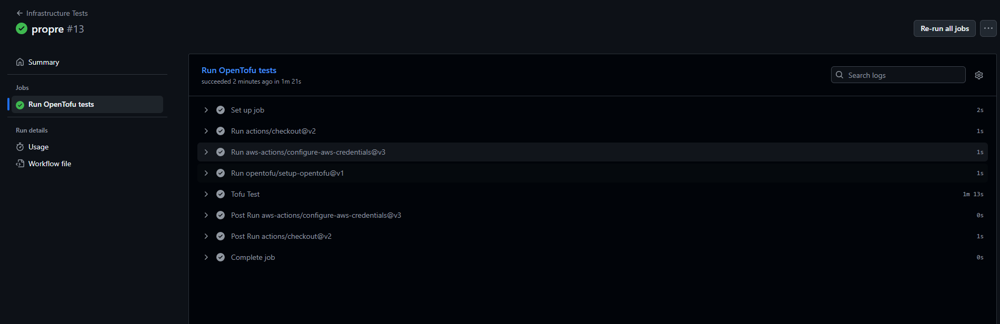
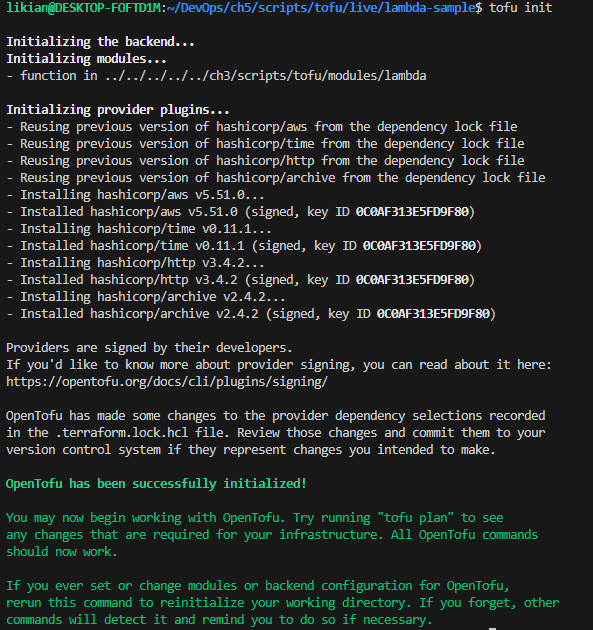
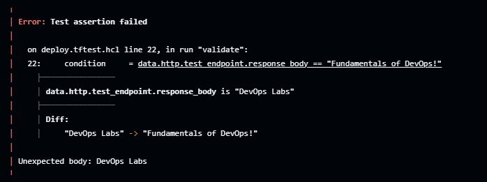

## 1. Objectifs
Lier tout ce que nous avons vu : Git déclenche les tests (Lab 4), qui déclenchent le provisioning (Lab 2), qui déploie sur K8s (Lab 3).

## 2. Sécurité : OIDC
Avant de créer le pipeline, j'ai configuré la sécurité. Au lieu de stocker mes clés `AWS_ACCESS_KEY` dans GitHub (ce qui est risqué), j'ai configuré **OpenID Connect (OIDC)**.
* **Principe :** J'ai créé un fournisseur d'identité dans AWS IAM qui "fait confiance" à mon repo GitHub.
* **Résultat :** GitHub Actions peut demander un token temporaire à AWS juste le temps du déploiement.

## 3. Le Pipeline GitHub Actions
J'ai créé le fichier `.github/workflows/deploy.yml`.

### 3.1 Intégration Continue (CI)
* **Trigger :** À chaque `Pull Request`.
* **Job :** Le pipeline installe Node, fait `npm install` et lance `npm test`.
* **Règle :** Si les tests échouent, le merge est bloqué. C'est la garantie qualité.

### 3.2 Livraison Continue (CD)
* **Trigger :** À chaque `push` sur la branche `main` (après merge).
* **Job Infra :** Utilisation d'OpenTofu.
    * `tofu plan` : Affiche les changements prévus dans les logs du pipeline.
    * `tofu apply` : Applique les changements automatiquement.
* **Job App :** Build de l'image Docker, push sur ECR, et mise à jour du déploiement Kubernetes (`kubectl set image`).

## 4. Expérience et Difficultés
* **Observation :** J'ai fait une modification simple du texte de l'app, j'ai pushé, et 5 minutes plus tard, la modification était en ligne sans intervention humaine de ma part sur les serveurs.
* **Difficulté :** Le débogage des fichiers YAML de GitHub Actions est parfois fastidieux (erreurs d'indentation).

## 5. Conclusion
J'ai mis en place un véritable pipeline DevOps moderne. Le code part en production automatiquement, mais uniquement si les tests valident le fonctionnement, assurant à la fois vitesse et stabilité.

