## 1. Introduction
Pour se rapprocher d'un cas réel d'entreprise, ce TP final visait à ne plus tout mettre dans un seul "sac". Nous avons séparé les environnements (Dev vs Prod) et découpé l'application (Microservices).

## 2. Isolation des Environnements

### 2.1 Multi-comptes AWS
* Nous avons vu la théorie des **AWS Organizations**. L'idée est d'avoir un compte AWS pour la prod et un autre pour le dev.
* **Intérêt :** Si je détruis tout par erreur en dev, la prod n'est absolument pas impactée car c'est un compte isolé.

### 2.2 OpenTofu Workspaces
N'ayant pas forcément accès à plusieurs comptes réels pour le TP, j'ai utilisé les **Workspaces** d'OpenTofu.
* **Commandes :**
    ```bash
    tofu workspace new dev
    tofu workspace new prod
    ```
* **Fonctionnement :** Avec le *même* code `main.tf`, OpenTofu gère deux fichiers d'état (`terraform.tfstate`) distincts.
* **Variable :** J'ai utilisé une variable `environment` pour changer la taille des instances (t2.micro en dev, t2.small en prod) selon le workspace actif.

## 3. Microservices sur Kubernetes
J'ai déployé une architecture composée de deux services : un **Frontend** et un **Backend**.

* **Déploiement :** J'ai créé deux sets de fichiers YAML (Deployment + Service) pour le front et le back.
* **Service Discovery :** C'était le point clé.
    * Le Frontend doit appeler le Backend.
    * Dans Kubernetes, je n'utilise pas d'IP fixe. J'ai utilisé le nom DNS interne fourni par K8s : `http://backend-service`.
    * K8s résout automatiquement ce nom vers les pods du backend.

## 4. Conclusion Générale
Ce dernier TP conclut le cursus. Je suis passé de l'exécution d'un script Node.js sur mon PC (Lab 0) à une infrastructure complexe, automatisée, testée, capable de gérer plusieurs environnements et services distribués sur le Cloud. J'ai acquis une vision globale de la chaîne de valeur DevOps.

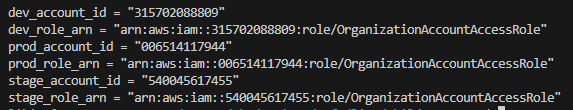
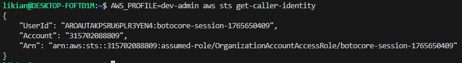
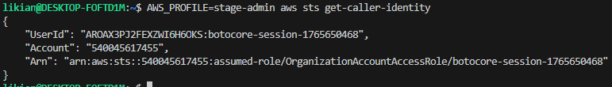
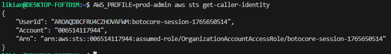
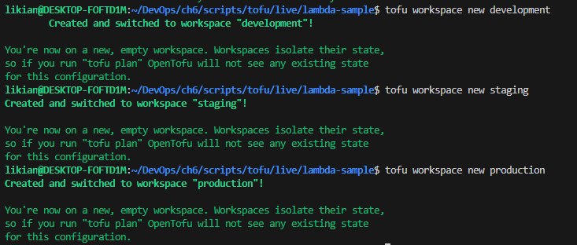
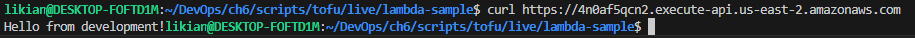
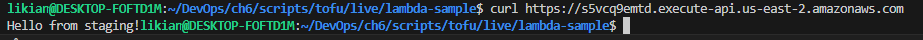
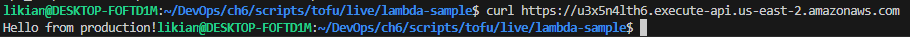
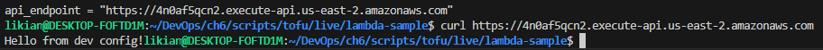
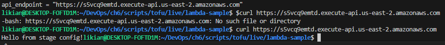
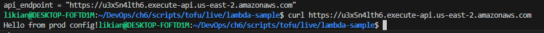
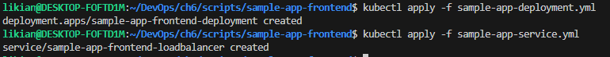
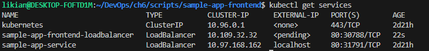
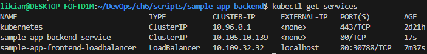
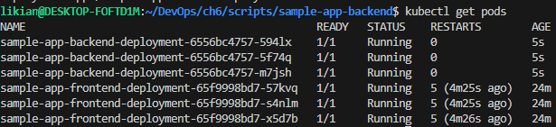
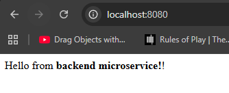