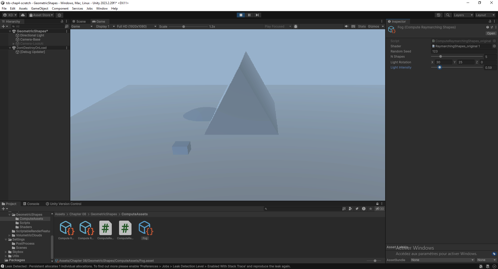
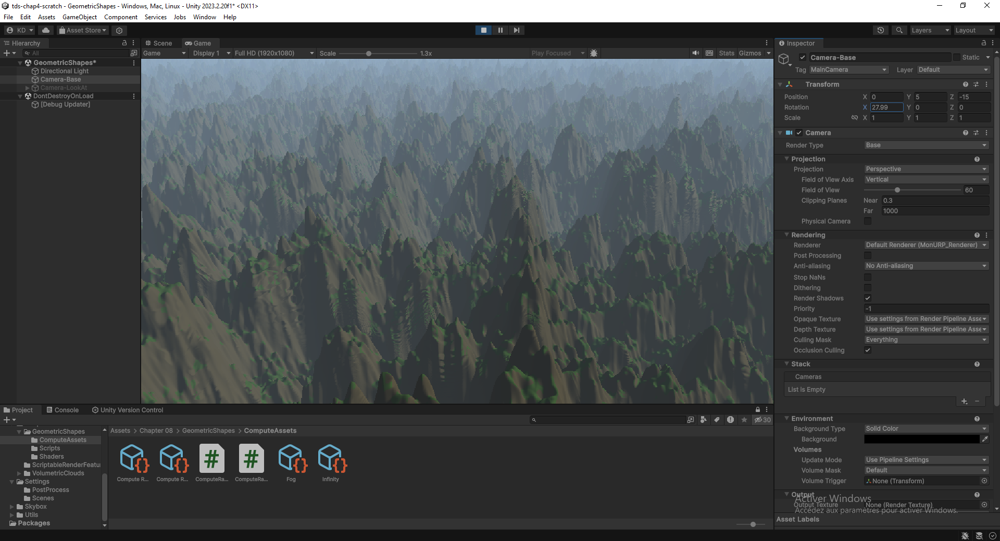

-----

## Objectif du TD

Ce TD a pour but de créer un second shader de calcul, `RaymarchingShapes.compute`, pour effectuer le rendu de **plusieurs formes en même temps**. Nous étendons le processus de rendu par marche de rayons pour gérer quatre types de formes (sphères, cubes, tores et prismes) et combiner plusieurs objets pour créer la scène FDS finale.

-----

## I. Définition des Géométries Procédurales (SDFs)

Nous définissons de nouveaux FDSs inspirés de la liste d'Inigo Quilez pour nos nouvelles formes dans `RaymarchingShapes.compute`.

```c
float sdfCube(float3 p, float3 center, float3 size) {
    float3 o = abs(p - center) - size;
    float ud = length(max(o,0));
    float n = max(max(min(o.x, 0), min(o.y, 0)), min(o.z, 0));
    return ud + n;
}

float sdfTorus(float3 p, float3 center, float r1, float r2) {
    float2 q = float2(length((p - center).xz) - r1, p.y – center.y);
    return length(q) - r2;
}

float sdfPrism(float3 p, float3 center, float2 h) {
    float3 q = abs(p - center);
    return max(q.z - h.y, max(q.x * 0.866025 + p.y * 0.5, -p.y) - h.x * 0.5);
}
```

## II. Structuration des Données et Transfert GPU

Nous créons une structure de données `Shape` pour représenter chaque instance de forme, ainsi qu'un `StructuredBuffer` pour transférer la liste des formes du CPU au GPU.

```c
struct Shape {
    int shapeType;      // 0: Sphère, 1: Cube, 2: Tore, 3: Prisme
    float4 color;       // Couleur de la surface (RGBA)
    float3 position;    // Position de l'objet
    float3 size;        // Échelle/Dimensions
};
StructuredBuffer<Shape> Shapes; // Buffer sur le GPU
int NShapes;                   // Nombre de formes
```

## III. Sélection du SDF (`sdfShape`)

Nous enveloppons la logique de sélection du SDF approprié en fonction du `shapeType` dans une fonction utilitaire.

```c
float sdfShape(Shape shape, float3 p) {
    if (shape.shapeType == 0) {
        return sdfSphere(p, shape.position, shape.size.x);
    }
    else if (shape.shapeType == 1) {
        return sdfCube(p, shape.position, shape.size);
    }
    else if (shape.shapeType == 2) {
        return sdfTorus(p, shape.position, shape.size.x, shape.size.y);
    }
    else if (shape.shapeType == 3) {
        return sdfPrism(p, shape.position, shape.size);
    }
    return MAXIMUM_TRACE_DISTANCE;
}
```

## IV. Combinaison des SDFs (Opération d'Union)

La fonction `mapSceneSdf` est mise à jour pour combiner toutes les formes. Elle retourne maintenant un `float4` : les trois premières composantes pour la couleur de la surface (`globalColor`) et la dernière composante pour la distance (`globalDist`).

La combinaison de formes se fait par l'opération d'**Union** (trouver la distance minimale), qui simule correctement le système de profondeur.

```c
float4 mapSceneSdf(float3 p) {
    float globalDist = MAXIMUM_TRACE_DISTANCE;
    float3 globalColor = float3(0, 0, 0);
    
    for (int i = 0; i < NShapes; i ++) {
        Shape shape = Shapes[i];
        float shapeDist = sdfShape(shape, p);
        float3 shapeColor = shape.color.xyz;
        
        // Opération d'Union (Min) : retenir la distance la plus courte (forme la plus proche)
        if (shapeDist < globalDist) {
            globalDist = shapeDist;
            globalColor = shapeColor;
        }
    }
    return float4(globalColor, globalDist);
}
```

## V. Mise à jour de la Marche des Rayons (`raymarch`)

La fonction `raymarch` est modifiée pour extraire la distance et la couleur de surface du `float4` retourné par `mapSceneSdf`.

```c
float3 raymarch(float3 rayOrigin, float3 rayDirection) {
    float totalDistanceTraveled = 0;
    while (totalDistanceTraveled < MAXIMUM_TRACE_DISTANCE) {
        float3 currentPosition = rayOrigin + totalDistanceTraveled * rayDirection;
        float4 sceneSdf = mapSceneSdf(currentPosition);
        
        float dist = sceneSdf.w; // Distance à la surface (w)
        
        if (dist <= MINIMUM_HIT_DISTANCE) {
            float3 normal = estimateNormal(currentPosition);
            float diffuseIntensity = saturate(dot(normal, -DirectionalLight.xyz)) * DirectionalLight.w;
            float3 surfaceColor = sceneSdf.xyz; // Couleur de la surface (xyz)
            return surfaceColor * diffuseIntensity;
        }
        totalDistanceTraveled += dist;
    }
    return float3(0, 0, 0);
}
```

## VI. Intégration C\# (ComputeRaymarchingShapes.cs)

La classe `ComputeRaymarchingShapes.cs` gère l'allocation, le remplissage et l'envoi du `ComputeBuffer` (`Shapes`) ainsi que des variables de caméra et de lumière.

**Logique C\# pertinente :**

```c
public override void Render(CommandBuffer commandBuffer, int kernelHandle) {
    Cleanup();
    if (_shapes.Count == 0) return;
    Camera camera = Camera.main;
    
    // Calcul de la taille de la structure Shape en octets
    int sizeofShape = sizeof(int) + sizeof(float) * (4 + 3 + 3); 
    
    _shapesBuffer = new ComputeBuffer(_shapes.Count, sizeofShape);
    _shapesBuffer.SetData(_shapes);
    
    // Envoi des variables au GPU
    commandBuffer.SetComputeBufferParam(shader, 0, "Shapes", _shapesBuffer);
    commandBuffer.SetComputeIntParam(shader, "NShapes", _shapes.Count);
    // ... Envoi des matrices de caméra et de la lumière
}
// La fonction Cleanup doit libérer le _shapesBuffer.Dispose()
```

<video controls src="tds-chap4-scratch - GeometricShapes - Windows, Mac, Linux - Unity 2023.2.20f1_ _DX11_ 2025-12-06 20-44-21.mp4" title="Title"></video>


<video controls src="tds-chap4-scratch - GeometricShapes - Windows, Mac, Linux - Unity 2023.2.20f1 _DX11_ 2025-12-06 22-40-40.mp4" title="Title"></video>
-----

## Questions Théoriques et Pratiques

### Principes de la Marche des Rayons

#### Théorique :

La **Marche des Rayons (Ray Marching - RM)** est une technique de rendu itérative qui utilise les **Champs de Distance Signée (SDF)** pour déterminer la distance minimale entre un point dans l'espace et la surface de la géométrie la plus proche. Le rayon avance par **pas adaptatifs** (la taille du pas est donnée par le SDF) jusqu'à atteindre la surface.

| Caractéristique | Ray Marching (RM) | Ray Tracing (RT) |
|:---:|:---:|:---:|
| **Géométrie** | **Implicite** (Fonctions mathématiques/SDF) | **Explicite** (Maillages, polygones) |
| **Intersection** | **Itérative/Approximative** (Basée sur le SDF) | **Analytique/Exacte** (Calcul direct) |

**Avantages du RM pour les scènes complexes :** Rendu efficace des **géométries procédurales et des fractales**, et gestion facile des **opérations booléennes** (union, intersection) par de simples fonctions `min()` et `max()`.

#### Pratique : Mise en œuvre d'un effet de brouillard volumétrique

Pour un effet de **brouillard volumétrique**, la logique du `raymarch` est modifiée pour **accumuler la couleur et la densité** à chaque pas, au lieu de s'arrêter à une surface.

**Pseudo-code de la boucle volumétrique :**

```c
float3 totalColor = 0;
float totalAlpha = 0;
float stepSize = 0.5; // Pas fixe pour le volume
while (totalDistanceTraveled < MAX_DIST) {
    float3 pos = rayOrigin + totalDistanceTraveled * rayDirection;
    
    float density = getVolumeDensity(pos) * GlobalDensity; // Densité (bruit 3D ou autre)
    
    // Accumulation de la lumière (lumière diffusée)
    float3 lightScattering = (1.0 - totalAlpha) * density * stepSize * FogColor;
    
    totalColor += lightScattering;
    totalAlpha += density * stepSize;
    
    totalDistanceTraveled += stepSize;
    if (totalAlpha > 0.99) break;
}
return totalColor;
```

**Paramètres à ajuster :** La **Densité (`GlobalDensity`)** pour l'opacité, la **Couleur du Brouillard (`FogColor`)** pour l'ambiance, et la **Taille du Pas (`stepSize`)** qui influence la précision du rendu (plus petit = plus précis/lent).

-----

### Génération de Scènes Procédurales avec la Marche des Rayons

#### Théorique :

Le RM est excellent pour la **génération de scènes procédurales** car un monde entier est défini par des **fonctions mathématiques**. La modification d'une graine aléatoire change l'ensemble de la scène.

  * **Application :** Moduler les paramètres des SDFs (position, échelle) ou appliquer des fonctions de **bruit** (Perlin, Simplex) aux fonctions de distance pour générer des détails organiques.
  * **Géométries bénéficiaires :** **Terrains Organiques** (SDF de plan modifié par du bruit), **Fractales** (Mandelbulb), et **détails à la volée** (surfaces érodées).

#### Pratique : Création d'un exemple de génération procédurale de terrain

**Algorithmes/Fonctions employées :** **Bruit de Perlin 3D** (combiné en octaves pour des variations de fréquence) et le **SDF de plan**.

**SDF du Terrain (Pseudo-code) :**

```c
float calculerHauteur(float2 p_xz) {
    // Bruit de Perlin multi-octave pour une hauteur réaliste
    float hauteur = 0.0;
    hauteur += 1.0 * PerlinNoise(p_xz * 0.5); 
    hauteur += 0.5 * PerlinNoise(p_xz * 1.5); 
    return hauteur * AmplitudeMax;
}

float mapSceneSdf(float3 p) {
    float hauteur_procedurale = calculerHauteur(p.xz);
    // Distance verticale du point p à la surface du terrain
    return p.y - hauteur_procedurale; 
}
```

-----

### Impact du Ray Marching sur la Génération de Scènes Procédurales

#### Théorique :

  * **Efficacité Spatiale (Mémoire) :** Impact positif majeur. Le RM offre une **compression de géométrie extrême** car seule la fonction mathématique est stockée, pas les sommets d'un maillage.
  * **Qualité Visuelle :** Le niveau de détail est potentiellement **infini** (fractales), offrant une meilleure qualité en gros plan qu'un maillage statique.
  * **Complexité et Performance :** La performance est transférée au **calcul GPU** (nombre d'itérations). Les scènes volumineuses mais peu détaillées sont rapides. Les scènes avec des SDFs complexes (bruit, nombreuses opérations booléennes) sont coûteuses.

#### Pratique : Évaluation des performances et optimisations

L'évaluation se fait par profilage GPU (via le **Unity Frame Debugger** ou le **Profiler**) pour mesurer le temps d'exécution du `Compute Shader`.

**Optimisations proposées :**

1.  **Volumes Englobants (Bounding Volumes) :** Utiliser des SDFs simples (sphère/cube) pour englober des géométries plus complexes. Si le rayon est loin du volume englobant, on ne calcule pas le SDF complexe.
2.  **Réduction du Pas de Sécurité :** Utiliser des techniques d'**Adaptive Stepping** ou augmenter légèrement le `MINIMUM_HIT_DISTANCE` pour les objets lointains (un compromis performance/précision).
3.  **Réutilisation du Bruit :** Si le bruit est coûteux, le précalculer et le stocker dans une **texture 3D** au lieu de le calculer à chaque pas.

-----

### Techniques Artistiques avec la Marche des Rayons

#### Théorique :

Le RM est un outil d'**expression artistique** puissant par sa capacité à manipuler l'espace de manière mathématique.

1.  **Manipulation Spatiale :** Déformer l'espace en appliquant des transformations ou des fonctions de bruit aux coordonnées d'entrée `p` avant le calcul du SDF (ex : effet de vortex, miroirs courbes).
2.  **Ombrage Procédural :** Utiliser des fonctions de bruit pour créer des variations dans la couleur, la rugosité ou l'émissivité sans textures bitmap.
3.  **Rendu Non-Photorealistic (NPR) :** Modifier la formule d'ombrage (ex : quantification de l'intensité diffuse) pour le *cel-shading*.

#### Pratique : Conception d'un effet artistique unique

**Effet :** Création d'une **Aura énergétique pulsée** autour d'un objet.

**Implémentation :**

1.  **SDF de Base :** $\text{SDF}_{\text{Objet}}(P)$ (un cylindre, par exemple).
2.  **SDF de l'Aura :** $\text{SDF}_{\text{Sphère}}(P, R_{\text{pulsé}})$. Le rayon est modulé par le temps : $R_{\text{pulsé}} = R_{0} + \sin(\text{\_Time.y} * \text{Vitesse}) * \text{Amplitude}$.
3.  **Combinaison :** Utilisation d'une **union lissée** (Smooth Union) entre l'objet et l'aura pour un raccord visuel fluide. L'aura reçoit une couleur fortement **émissive** (lumineuse).
4.  **Contraintes de performance :** L'opération $\sin(\text{\_Time})$ est peu coûteuse, le principal coût réside dans le nombre d'itérations si l'aura est très grande.

-----

### Avancées et Défis Techniques de la Marche des Rayons

#### Théorique :

**Avancées Récentes :**

1.  **Compute Shaders / VFX Graph :** L'exécution des calculs sur le **GPU** permet une parallélisation massive et une création plus intuitive via l'édition nodale (VFX Graph Unity).
2.  **Rendu Hybride :** La combinaison du RM pour les **volumes** (nuages, brouillard) et du Ray Tracing/Rasterization pour les **surfaces** et l'illumination globale.
3.  **RT-SDFs (Real-Time SDFs) :** Recherche sur la génération dynamique de SDFs à partir de maillages traditionnels pour une meilleure interaction.

**Défis Techniques :**

1.  **"Tunneling" (Perforation) :** Le risque de rater une petite géométrie si le pas de la marche est trop grand (compromis performance/précision).
2.  **Optimisation Générale :** La difficulté d'optimiser le `mapSceneSdf` pour des scènes complexes, car chaque pas dépend de la complexité de l'ensemble de la scène.
3.  **Développement Artistique :** La nécessité de connaissances mathématiques (algèbre linéaire et trigonométrie) pour créer des formes, ce qui rend la courbe d'apprentissage plus raide que la modélisation polygonale.
