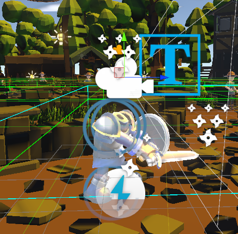
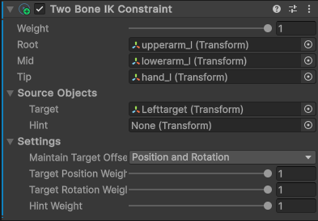
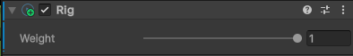
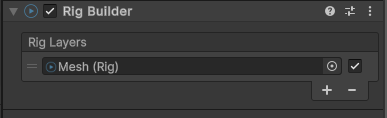
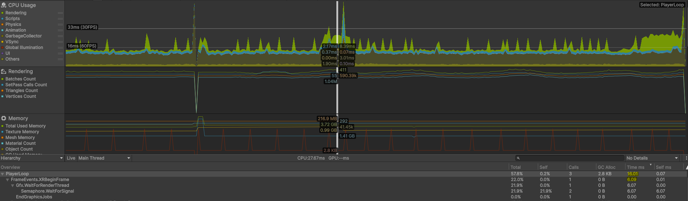
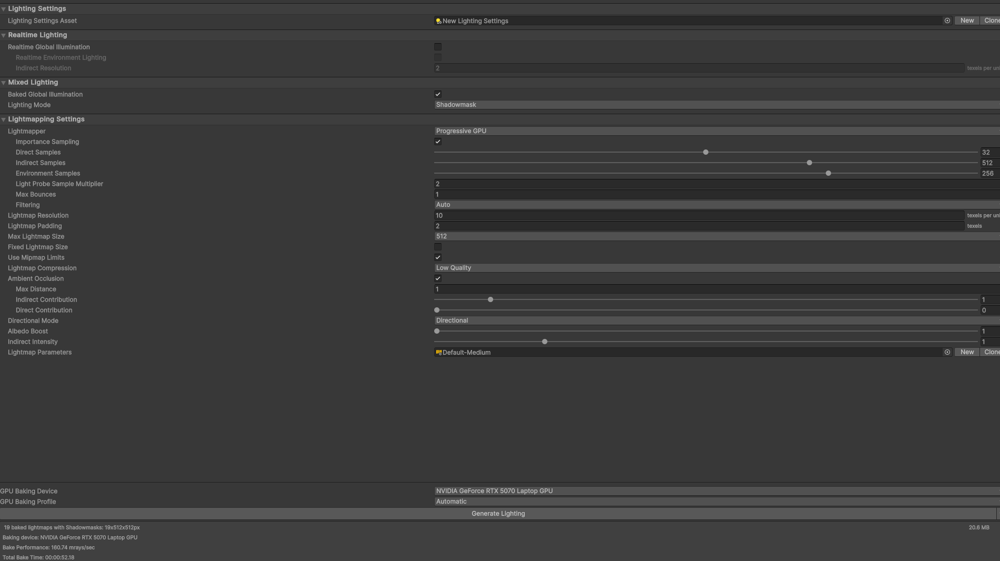
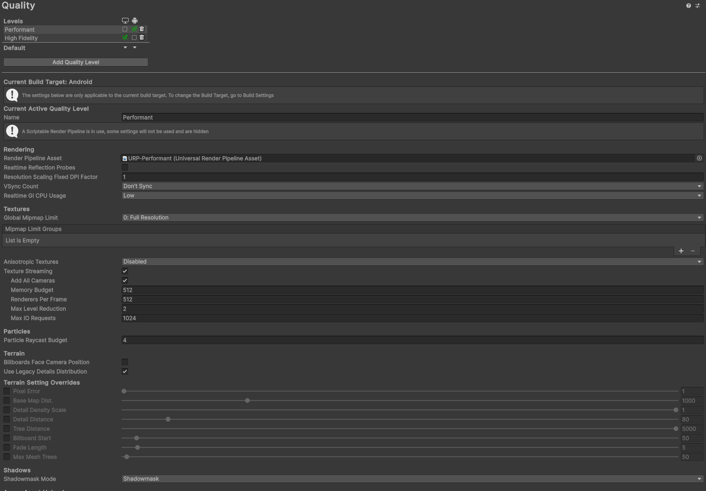

## Contexte du projet

Dans le cadre de ce semestre, nous avons travaillé sur le portage VR de notre jeu Unity. L'objectif principal était de conserver l'identité du gameplay d'origine tout en apportant une vraie sensation d'immersion en réalité virtuelle.

Le projet nous a confrontés à un enjeu central : en VR, la qualité de l'expérience ne dépend pas uniquement du game design, mais aussi de la stabilité des performances. Un jeu visuellement riche sur ordinateur peut devenir injouable en casque si le framerate n'est pas suffisant. Sur Quest 3, la cible minimale est de **72 FPS constants** — en dessous, l'expérience devient inconfortable et peut provoquer du motion sickness.

---

## Principes d'immersion en VR

Pour renforcer l'immersion, nous avons appliqué plusieurs principes :

- Placer la caméra exactement à la position de la tête du personnage.

- Conserver le mesh du chevalier pour garder l'identité visuelle.
- Retirer la tête du mesh afin d'éviter les conflits de rendu avec la caméra VR.
- Déformer le corps pour qu'il suive les mouvements réels du joueur.
<video controls src="Enregistrement de l'écran 2026-05-22 230501.mp4" title="Title"></video>

Nous avons utilisé des **Two Bone Constraint IK** et un **Rig Builder** pour faire suivre les bras du personnage aux controllers. Ainsi, le joueur n'a pas besoin d'appuyer sur un bouton pour frapper ou parer : il bouge directement ses bras, et l'avatar reproduit le geste. Ce choix améliore la cohérence entre action réelle et action en jeu, ce qui augmente fortement la sensation de présence.

---

## Choix de déplacement

Nous avons opté pour un déplacement au joystick, combiné à l'orientation de la caméra.

Pourquoi ce choix est pertinent :

- Le joystick permet un déplacement continu, précis et familier pour la plupart des joueurs.
- L'orientation par la caméra rend les intentions de mouvement naturelles (on avance dans la direction regardée).
- Cette approche s'intègre bien avec le combat, car les mains restent disponibles pour les actions d'attaque et de parade.
<video controls src="Enregistrement de l'écran 2026-05-22 231416.mp4" title="Title"></video>

Ce système reste un bon compromis entre confort, précision et fluidité de gameplay.

---

## Difficultés de l'adaptation UI / Menus en VR

L'UI 2D classique ne fonctionne pas directement en VR. Nous avons dû repenser plusieurs aspects :

- Taille des textes et lisibilité en profondeur.
- Positionnement des menus dans l'espace 3D.
- Interaction pointeur/raycast avec les controllers.
- Réduction de la surcharge visuelle pour ne pas casser l'immersion.

<video controls src="Enregistrement de l'écran 2026-05-22 231651.mp4" title="Title"></video>

Adapter les menus à la VR demande donc un travail de design spécifique, et pas seulement un simple portage technique.

---

## Difficultés de performance et optimisation

La plus grande difficulté du projet a été l'optimisation.

Au début, les performances étaient entre **15 et 30 FPS**. Après plusieurs semaines d'optimisation, nous avons réussi à atteindre environ **70 FPS** dans de meilleures conditions. C'est une progression importante, mais insuffisante pour garantir un portage VR complet et stable dans tous les cas.

Nous avons utilisé le **Profiler Unity** pour identifier les goulets d'étranglement. L'analyse a révélé que `Semaphore.WaitForSignal` occupait **90.7% du temps de frame (72ms)**, ce qui indique un bottleneck GPU pur : le CPU attendait le GPU à chaque frame. Ce diagnostic a été confirmé par un comportement caractéristique — le jeu tournait correctement en regardant le sol, mais chutait sévèrement en regardant la scène de face, directement lié à ce qui est rendu à l'écran.

Les problèmes principaux étaient localisés :

- Dans le rendu (GPU) : trop d'objets à dessiner par frame, shaders trop coûteux, éclairage dynamique non baked.
- Dans certains scripts coûteux (CPU) : appels récurrents non optimisés dans les boucles de jeu.

Nous avons corrigé une partie des scripts, mais un problème majeur de rendu persiste. Aujourd'hui, ce problème empêche le jeu de tourner correctement en standalone VR, sauf dans des cas limités. Malgré nos efforts, nous n'avons pas encore identifié précisément la cause finale de ce blocage — les pistes restantes incluent l'Occlusion Culling, le GPU Instancing, la compression ASTC des textures, et le Fixed Foveated Rendering, non disponible avec notre version du plugin OpenXR.

---

## Pipeline de rendu VR

Nous utilisons **URP (Universal Render Pipeline)** avec le mode **Single Pass Instanced / Multi-view**, qui rend les deux yeux en une seule passe GPU — c'est le mode optimal pour la VR, évitant de doubler le coût de rendu. L'API graphique cible est **Vulkan**, avec **Symmetric Projection** activé pour réduire la charge GPU en forçant des frustums symétriques pour les deux yeux.

Ce pipeline a été configuré via **XR Plug-in Management > OpenXR**, en utilisant le feature group **Meta Quest Support** sur Android.

---

## Optimisations réalisées

Voici les actions concrètes mises en place :

- **Activation du culling sur les meshes** : les objets hors du champ de vision ne sont plus envoyés au GPU.
- **Bake des lumières** : suppression du calcul d'éclairage en temps réel, remplacé par des lightmaps précalculées.
- **Passage en mode graphique allégé** : abandon du preset High Quality au profit d'un profil Android optimisé (shadows désactivées, pixel light count à 0).
- **Remplacement de meshes lourds** : certains modèles ont été remplacés par des versions à triangle count réduit.
- **Suppression des effets post-process coûteux** : aberration chromatique, bloom et autres effets temps réel ont été supprimés ou réduits.
- **Optimisations de code** : suppression d'appels récurrents inutiles dans les scripts de combat et de gestion des ennemis.

<video controls src="20260522-2119-33.9892475.mp4" title="Title"></video>

| Optimisation | Impact estimé |
|---|---|
| Bake des lumières | Suppression des calculs dynamiques par frame |
| Suppression post-process | Gain de 10-15 FPS |
| Réduction des meshes | Moins de triangles envoyés au GPU |
| Culling des meshes | Réduction des draw calls hors champ |
| Optimisation scripts | Réduction du temps CPU par frame |

Nous avons également fait l'impasse sur la majorité des effets visuels introduits au semestre précédent pour conserver un framerate plus élevé.

---

## Adaptation des énigmes à la VR

Le passage en VR a nécessité de repenser le système d'interaction avec les objets des énigmes. L'objectif était de rendre les manipulations intuitives sans recourir à un système de grab classique, pour rester accessible et éviter les problèmes de prise en main complexe.

### Énigme des miroirs

L'énigme des miroirs consiste à rediriger un laser vers une cible en positionnant correctement des miroirs dans la scène. En VR, approcher un miroir le fait automatiquement s'attacher à la main du joueur, sans qu'il ait besoin d'appuyer sur un bouton de saisie. Il peut ensuite le déplacer et l'orienter librement dans l'espace, puis le relâcher pour le poser.

Ce choix d'interaction magnétique présente plusieurs avantages :
- Il supprime la friction liée aux boutons de grip, souvent source de confusion pour les nouveaux joueurs VR.
- Il donne une sensation naturelle de manipulation physique directe.
- Il s'adapte bien à une énigme qui demande de la précision d'orientation.

<video controls src="video-miroir.mp4" title="Énigme des miroirs"></video>

### Énigme de l'armure

L'énigme de l'armure demande au joueur de reconstituer une armure complète en se basant sur une description fournie dans le jeu. Plusieurs pièces d'armure sont disponibles, et le joueur doit sélectionner les bonnes en interagissant avec elles. Un simple clic sur une pièce permet de switcher entre les variantes disponibles pour cet emplacement, jusqu'à correspondre à la description.

Ce système évite toute manipulation physique complexe — pas de déplacement d'objet ni de snap zone à viser — ce qui le rend particulièrement adapté à la VR où les interactions trop précises peuvent être frustrantes. Le joueur se concentre sur la lecture de la description et le choix des bonnes pièces, ce qui préserve l'aspect réflexion de l'énigme.

<video controls src="video-armure.mp4" title="Énigme de l'armure"></video>

---

## Bilan

Le portage VR a permis de valider des choix solides sur l'immersion et l'incarnation du joueur (caméra à la tête, bras pilotés en IK, interaction physique en combat). En revanche, la contrainte de performance reste le facteur limitant principal.

<video controls src="Enregistrement de l'écran 2026-05-22 233028.mp4" title="Title"></video>

En l'état, le projet montre que :

- Le gameplay VR est fonctionnel et cohérent.
- Les fondations techniques sont en place (URP, Single Pass Instanced, Vulkan, lumières baked).
- Le rendu global reste trop coûteux pour un standalone VR fiable dans toutes les conditions.

Le portage complet en VR nous est donc impossible pour l'instant. Les pistes d'optimisation restantes — Occlusion Culling agressif, GPU Instancing sur les objets répétitifs, texture atlasing, réduction des transparences, simplification des shaders, et Fixed Foveated Rendering via un SDK Meta plus récent — constituent la feuille de route pour atteindre les 72 FPS stables requis.
